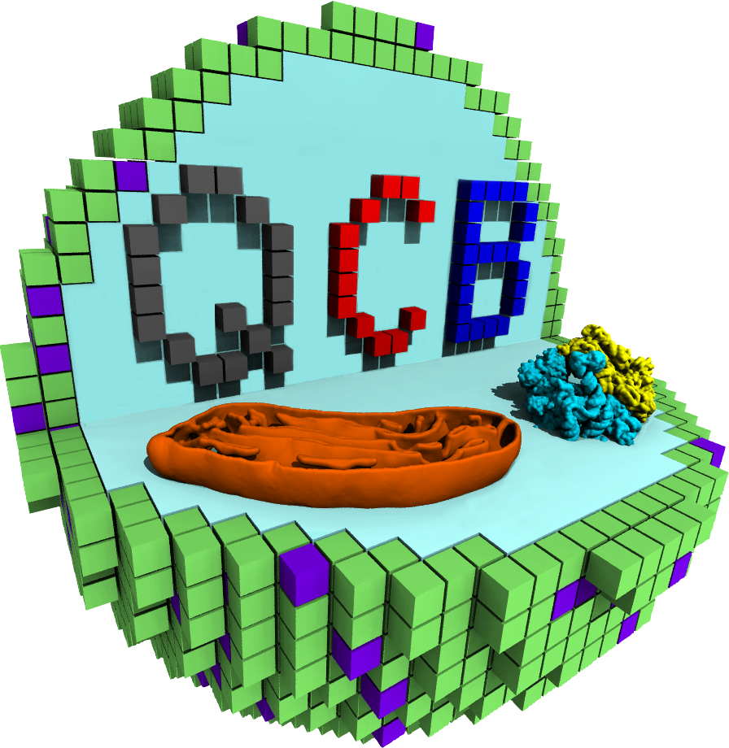
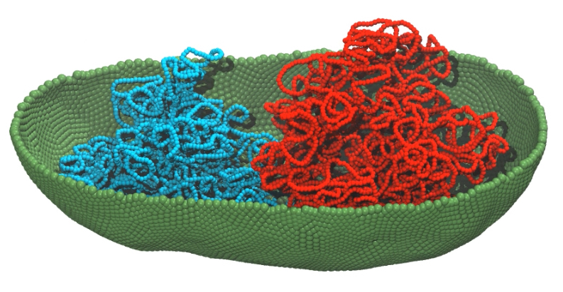
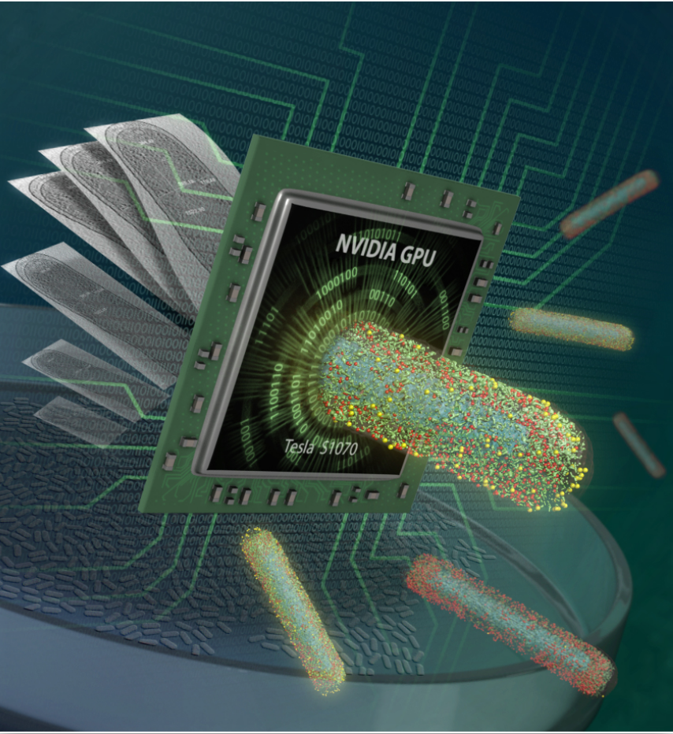

#  STC-QCB Advanced Computational Workshop 2024: Lattice Microbes and DNA model 
<!---
old image code

-->

   

Welcome to the repository for the STC-QCB Advanced Workshop 2024, focusing on Lattice Microbes. This workshop is targeted to those who have been using computational tools for a while and want to increase their knowledge and skills. 

## About the Workshop

Diverse experimental data characterizing the cellular state and processes of the synthetic genetically minimal bacterial cell, JCVI-Syn3A, have been integrated into 4DWCM simulations of its time dependent cell states. Dynamics of the cell states and biomolecules are described at the composite particle level using Lattice Microbes,  at the coarse-grained atomistic level using Martini/GROMACS, and at the all atom level using NAMD2 and GROMACS. For each representation, visualization is performed using VMD.  The workshop will demonstrate how each computational method is performed on Syn3A and how information is passed between each program.

Hosted by [The Center Quantitative Cell Biology (QCB)](https://qcb.illinois.edu/), this workshop aims to provide participants with an in-depth understanding of the Lattice Microbes v2.4 for whole-cell modeling.

### Schedule
- **Date:** May 6, 2024 - May 10, 2024 
- **Location:** University of Illinois Urbana-Champaign
- **Format:** in person

| Day | Date         | Instructors                                          | Morning Session                                                                    | Afternoon Session                                                                         | Teaching Assistants                              |
|-----|--------------|------------------------------------------------------|------------------------------------------------------------------------------------|------------------------------------------------------------------------------------------|-------------------------------------------------|
| 1   | Monday, May 6| Zan Luthey-Schulten, Zane Thornburg, Ben Gilbert     | Introduction to cellular processes in JCVI-Syn3A and Lattice Microbes             | **LM models of metabolism, DNA replication, transcription, translation, and growth**         | **Enguang Fu, Andrew Maytin, Tianyu Wu**            |
| 2   | Tuesday, May 7| Siewert-Jan Marrink, Weria Pezeshkian, Zane Thornburg| Introduction to Martini 2 & 3 force field and tools                               | Martini metabolites, lipids, proteins, ribosomes, and DNA in JCVI-Syn3A                  | Jan Stevens, Aaron Chan, Bart Bruininks         |
| 3   | Wednesday, May 8| Erik Lindahl, John Stone, Zane Thornburg            | New features of Gromacs and Martini/Gromacs simulations                            | VMD Visualization and Movies of JCVI-Syn3A                                               | Jan Stevens, Enguang Fu, Bart Bruininsk         |
| 4   | Thursday, May 9| Erik Lindahl, Siewert-Jan Marrink, Emad Tajkorshid   | Further applications of and discussions about Martini/Gromacs simulations         | Free time – projects on NCSA Delta and picnic                                            | -                                               |
| 5   | Friday, May 10| Shulei Wang, Zan Luthey-Schulten                     | Introduction to machine learning of LM trajectories of the minimal cell and bringing cells to Minecraft| -                                                         | Rong Wei, Kevin Tan, Tianyu Wu                  |

## Sections on Lattice Microbes

  

The LM section of the workshop will feature a series of lectures, hands-on sessions, and discussions led by renowned scientists in the field. Participants will have the opportunity to engage in interactive sessions that cover a range of topics including:

- Stochastic Modeling with Chemical Master Equation (CME)
- Stochastic Modeling with Reaction Diffusion Master Equation (RDME)
- Whole-cell Modeling with CME-ODE
- Whole-cell Modeling with RDME-ODE

Link to Software: [Lattice Microbes Github](https://github.com/Luthey-Schulten-Lab/Lattice_Microbes)

Related Publications:
- Roberts et al. J. Comp Chem 2012 [Link](https://onlinelibrary.wiley.com/doi/full/10.1002/jcc.23130)
- Bianchi et al. IET Systems Biology 2018 [Link](https://ietresearch.onlinelibrary.wiley.com/doi/full/10.1049/iet-syb.2017.0070)
- Thornburg et al. Cell 2022 [Link](https://www.cell.com/cell/fulltext/S0092-8674(21)01488-4)

## Section on DNA Modeling

  

The DNA Modeling section of the workshop will feature a series of lectures, hands-on sessions, and discussions led by renowned scientists in the field. Participants will have the opportunity to engage in interactive sessions that focus on modeling the bacterial chromosome including:
- Brownian Dynamics of the chromosome
- Replication of the chromosome
- Protein-DNA interactions restructuring the chromosome organization

Link to Software [bTreeChromo Github](https://github.com/brg4/btree_chromo)

Link to Pubilication [Gilbert et al. Frontiers in Cell & Dev Bio 2023](https://www.frontiersin.org/articles/10.3389/fcell.2023.1214962/full)

## Contact Us

For any inquiries related to the workshop, please feel free to contact us at qcb at beckman.illinois.edu. 

Stay updated with the latest news and announcements by visiting our official website: [QCB Workshop Official Website](https://qcb.illinois.edu/).

## Acknowledgements

We would like to extend our gratitude to Professor Zaida Luthey-Schulten and her group members who are making this event possible. Great thanks to all previous group members and external collaborators who made Lattice Microbes software.

## License

---

We look forward to welcoming you to the STC-QCB Advanced Workshop 2024 and exploring the fascinating world of whole-cell modeling together!
